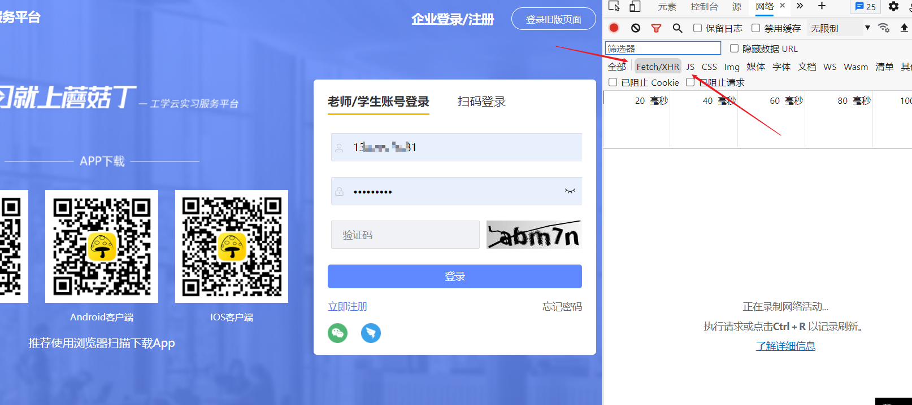
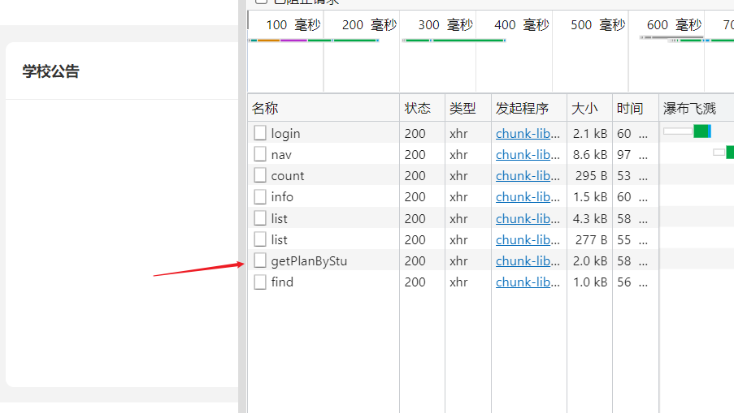
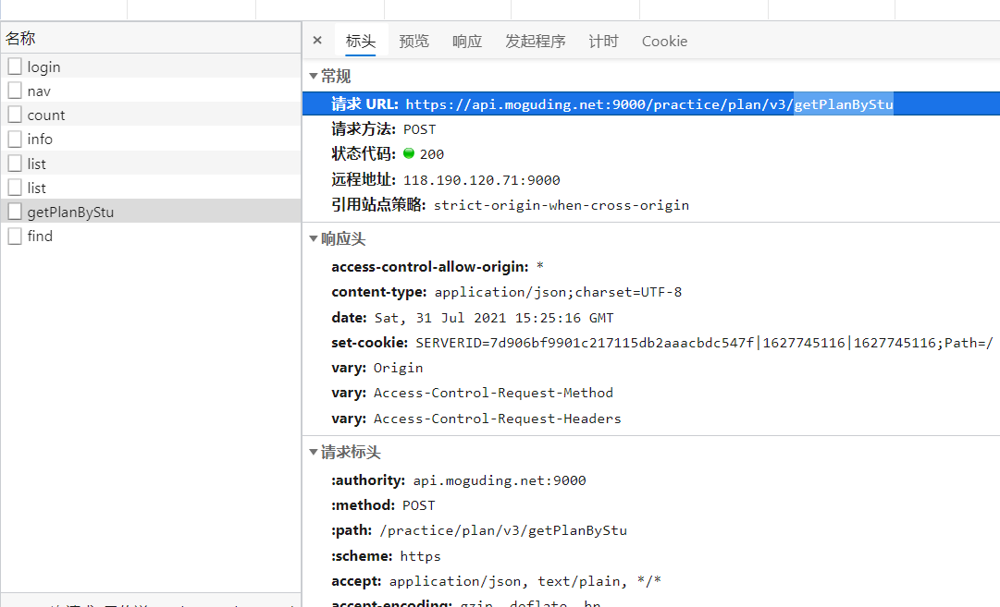
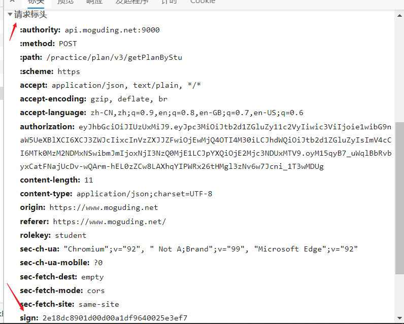

# 蘑菇钉自动打卡


[](https://golang.org/)
[](https://github.com/ToWeLong/go-mogu/blob/main/LICENSE)
> 用法：首先找到`.env.example`文件，打开并修改其中的隐私信息，去掉后缀`.example`，存储为`.env`文件即可。

> 重要： 由于蘑菇钉最近更新了接口，导致之前的接口都不可用了，然后还新增了一个sign，也就是签名。
> 没有sign签到不了，而且由于不知道sign的加密方式以及sign的加密需要哪些字段，
> 现在提供以下方案进行解决，若后续有大佬知道的话欢迎提PR，也欢迎使
sign的获取方式：
- 1. 登录蘑菇钉网页版[蘑菇钉](https://www.moguding.net/login)
- 2. 输入账号密码以及验证码后按F12调试模式
     
- 3. 选中getPlanByStu
     
     
     
- 4. .env文件中填入sign即可
    
# 完成
- [X] 自动签到
- [X] 周报自动编写
- [X] 日志记录


# 测试单个函数(去除cached)
```bash
go test -count=1 -v -run ^TestWeek$ towelong/mogu/test
```
